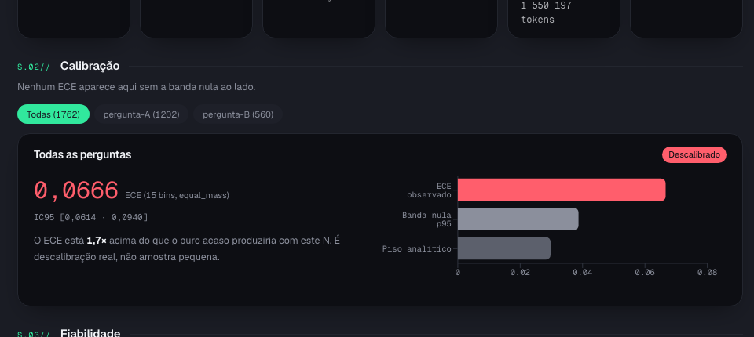
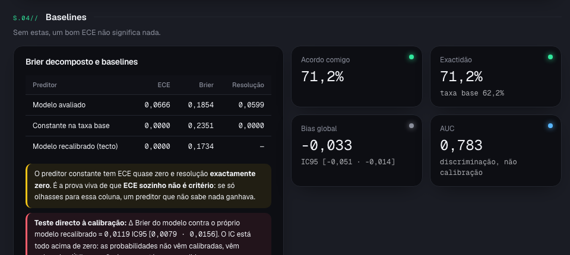
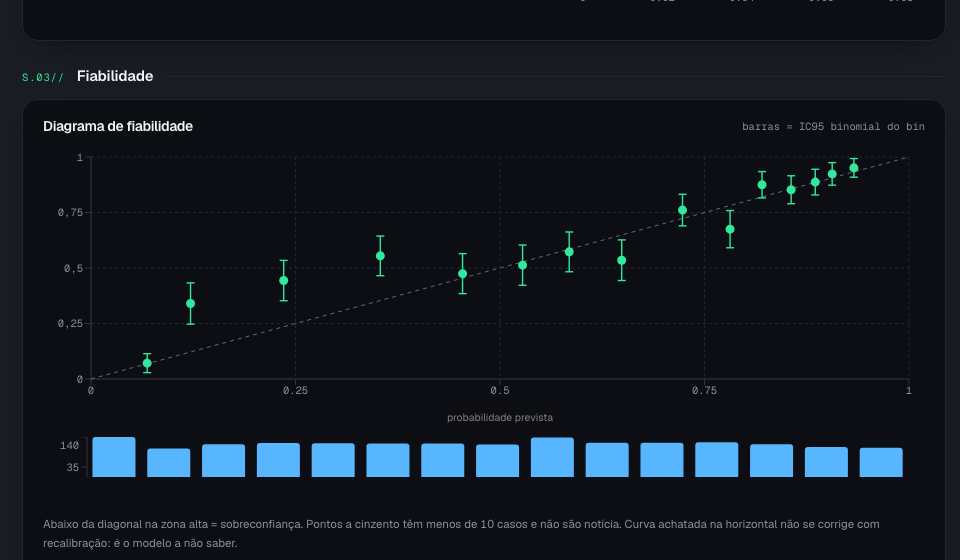
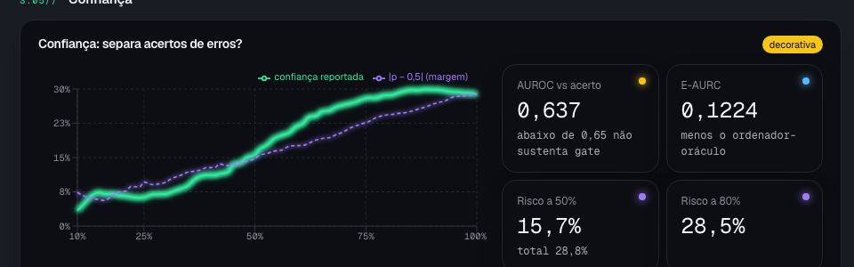

**TL;DR.** I had a commercial decision model answer the same question I did, across 1,202
documents, for six cents. It agreed with me 71% of the time and ranks well, but the number it
returns is not a trustworthy probability: a trivial recalibration built from my own data beats
it. What is worth keeping here is not the verdict on the product, it is the protocol, and the
proof that it works is that it caught me, halfway through, publishing a conclusion that did not
survive more data.

## Context

There is a new category of models that do not write text. They take a state and a closed
question and return a number between 0 and 1: *"is this request urgent?"* → `0.87`. They are
fast, cost almost nothing, and ship with a specific promise: **the probabilities are
calibrated**, meaning that when they say 0.9, they are right about nine times out of ten.

That promise is the difference between a tool and an ornament. If the number is calibrated you
can build a gate on top of it: above 0.9 act alone, below 0.5 call a human. If it is not, the
gate is decoration with decimals.

The problem is that the promise is **unverifiable from outside**. No paper, no published curve,
and the vendor documentation recommends no metric for testing it. Only your own test answers.

This article is about building that test. I do not name the vendor, for a reason that is also a
lesson: **the terms of service of several vendors forbid publishing benchmarks or performance
information about the product.** If you plan to publish your evaluation, read the terms before
you start it, not after.

## The framework: five rules of shadow mode

The design is called **shadow mode**: the model runs alongside the human and **never touches
the output**. Nothing it says enters a report, a ticket or a decision. It is only recorded next
to the human answer, for later comparison.

### 1. Seal before you ask

The human verdict is written **first** and sealed with a hash. Recording the model's answer is
**refused by the engine** if no prior human verdict exists for that case.

This is not bureaucracy. Without the seal, months later you cannot tell *"the model was right"*
from *"I agreed with the model because I read its answer first"*. That is data leakage, it has
no retroactive fix, and it destroys the only reason the exercise exists.

One detail that matters: if you rewrite your verdict **after** the model answers, the seal
breaks and the case leaves the measurement. It is not deleted, it is exposed in its own list. A
rule that depends on discipline is not a rule.

### 2. Project, do not send

No document travels. What travels is a **projection**: a dictionary built by your code, with
the fields declared up front. If an undeclared field shows up along the way, the engine refuses
rather than letting it through.

```python
Projeccao(
    nome="claim_has_source",
    campos=("claim", "has_citation", "source_shape", "has_number"),
    construir=_claim,
)
```

In the projection above the sentence goes out but the source does **not**: only the *shape* of
the source goes (path, URL or none). On top of this there is always a redaction pass for
emails, phone numbers, tax identifiers and user paths.

A side benefit that is not a side benefit: many questions are answered by the **shape** of the
document rather than its content. If the projection is structural, the test stops being a
privacy problem.

### 3. Read the error against the noise, never alone

This is the rule most people get wrong, and I got it wrong halfway through this work.

The usual calibration metric is **ECE**, the average gap between what the model promises and
what happens. The problem is that ECE has a **noise floor**: even a perfectly calibrated model
returns ECE above zero when you have few cases, for the same reason ten flips of a fair coin
rarely give five heads.

The decision metric is not ECE. It is the pair **(observed ECE, 95th percentile of ECE under
perfect calibration)**. You simulate that second number: take the probabilities the model
returned, generate thousands of worlds where it is right by construction, and see what ECE that
produces with your N and your binning.

The analytic shortcut, for sizing **before** collecting:

```
floor ≈ sqrt(2 · var · B / (π · N))
```

| Cases | Noise floor | Only call it miscalibrated above |
|---|---|---|
| 50 | 0.083 | ECE 0.15 |
| 150 | 0.073 | ECE 0.15 |
| 400 | 0.066 | ECE 0.09 |
| 800 | 0.047 | ECE 0.06 |
| 2,000 | 0.026 | ECE 0.05 |

**With 150 examples, an ECE of 0.07 is indistinguishable from perfect calibration.** And
detecting an effect of size δ requires the floor at about half of it, that is **four times** the
N that gets the floor there: detecting ECE 0.05 needs around 2,100 cases, not 535.



The panel I built has a single rule: **no calibration number appears without the band next to
it**, and the middle label reads *"no answer yet"*, never *"good"*. A panel showing only ECE
would be worse than none, because it would lend the look of measurement to a guess.

### 4. Compare against the fool and against itself

Two baselines, and without them a good ECE means nothing.

**The constant predictor.** It always answers the base rate ("62% probability", always). It has
near-zero ECE and **exactly zero resolution**: it never distinguishes anything. If you only look
at the ECE column, a predictor that knows nothing beats the model. That is living proof that
this column is not a criterion.

**The model itself, recalibrated.** Take its probabilities and fit them with isotonic regression
on your own labels. If the probabilities were already calibrated, this should not improve
anything.



This is where the promise fell. The Brier difference between the model and the model recalibrated
was **+0.0119, with a 95% confidence interval of [0.0079 · 0.0156]**, entirely above zero, and it
repeated across three independent samples getting stronger each time. Translation: **the
probabilities come ranked, not calibrated.** Useful, and not what is being sold.

The reliability diagram says the same thing differently. The points sit almost entirely above
the diagonal: the model says 0.30 where reality is 0.55. That is not overconfidence, it is
systematic underconfidence.



Two things almost no diagram carries and both are mandatory: **binomial error bars** on each
point and a **count histogram** underneath. Without them you cannot tell miscalibration from a
small sample, and a huge deviation in a bin with four cases is not news.

### 5. Decide at the operating point, not on the aggregate metric

The aggregate metric can say the model's confidence is useful and, at the point where you would
actually cut, be useless or inverted. It happened to me: the aggregate curve said confidence
ranked better than the margin of the probability itself, but **a threshold of 0.8 covered 82% of
the corpus and carried more error (31%) than the low-confidence zone (23%)**.

The operational number is **risk at fixed coverage**: *"if I send 30% to human review, the error
on what stays automatic drops from X to Y"*. In my case, reviewing the worse half dropped error
from 30.9% to 18.5%. That is half a review saved, measured. A threshold is not.

And the panel always says how much is missing for the question to have an answer, instead of
pretending it already does:



## What I found

1,762 judgements across 1,202 documents (560 of them judged twice, with different rulers), in
about two minutes of network time, for **six cents**. Median latency of 701 ms from Europe.

- **Agreement with my judgement: 71.2%**, with a base rate of 62.2%.
- **It discriminates well** (AUC 0.783): it can tell which is more likely than which.
- **It does not calibrate**: ECE 0.0666 against a null band of 0.040, that is 1.7 times above
  what chance would produce, with the whole confidence interval above the band.
- **Biased downward** significantly (bias −0.033, CI95 [−0.051 · −0.014]).
- **It errs where it matters**: 9% error on the obvious cases, about **32% on the ambiguous
  ones**. In other words, it is good where I do not need it.

There were also three divergences between the vendor documentation and the running API that only
appeared with the network on: a documented field that does not exist for that question type, the
impossibility of pinning the model version (the account only exposes moving aliases), and a
standard deviation of 0.032 between identical calls, three times the published figure. **Code
written against documentation is not verified code.**

## The part that caught me

Halfway through, at 400 cases, I wrote that the model was proven miscalibrated. ECE was 1.18
times above the band. I published the conclusion internally.

At 560 cases the conclusion **vanished**: ECE dropped, the band dropped less, and the verdict
became *"no answer yet"*. Only at 1,202 cases, with the whole confidence interval above the
band, did the claim come back and hold.

A marginal reading does not survive more data. The panel was built precisely to prevent that
error, and the first person it caught making it was me. I leave this written because it is the
best evidence I have that the instrument is worth something.

## What you gain, and almost none of it comes from the model

The work of testing produced more value than the tool being tested:

- **A cleanup list with names.** I found that 38% of my document library does not carry, inside
  the file itself, the evidence for what it claims. Twenty-five of those have an automatic
  counter asserting usage the file does not support.
- **A deterministic filter that does not fail.** A document without a single date inside has no
  evidence: 29 out of 29, human and model agreeing. It is a text search, runs in milliseconds,
  costs nothing. It becomes the first gate.
- **Twelve hundred labels of my own**, which work with or without this vendor and are what makes
  training a local alternative possible later.

The rule that stays: **it ranks, you decide.** The model comes in as a labelling accelerator and
a queue sorter, never as a source of probability nor as a runtime dependency.

## Limits of this analysis

- **One question, one domain, one corpus.** I tested a binary question over text documents in
  Portuguese and English. Do not extrapolate to image classification, other languages or another
  kind of question.
- **The reference labels are mine.** That measures agreement with my criterion, not absolute
  correctness. In a blind arbitration with a second person, three of my rules turned out stricter
  than theirs, which changed 26 labels. The calibration conclusion **did not change** with the
  correction, but the agreement number did.
- **Part of the arbitration rules were discovered by looking at cases the model chose** (those
  where it disagreed). The ruler came from a person judging blind and is applied by fixed rule to
  the whole corpus, which is clean, but the path to it was biased. That is why the rounds stay
  separate and are never mixed.
- **I did not measure calibration by subgroup** with sufficient N. A model can be calibrated in
  aggregate and miscalibrated within every segment, through cancellation.
- **This is not a security audit** of the vendor, nor an assessment of the category. It is an
  acceptance test for one concrete workload.

## References

1. GPT-4 Technical Report, Figure 8 (calibration before and after post-training) · https://arxiv.org/abs/2303.08774 (accessed 2026-09-17)
2. Kadavath et al., *Language Models (Mostly) Know What They Know* · https://arxiv.org/abs/2207.05221 (accessed 2026-09-17)
3. Tian et al., *Just Ask for Calibration* · https://arxiv.org/abs/2305.14975 (accessed 2026-09-17)
4. Nixon et al., *Measuring Calibration in Deep Learning* · https://arxiv.org/abs/1904.01685 (accessed 2026-09-17)
5. Kumar et al., *Verified Uncertainty Calibration* · https://arxiv.org/abs/1909.10155 (accessed 2026-09-17)
6. Geifman et al., *Bias-Reduced Uncertainty Estimation* (AURC / E-AURC) · https://arxiv.org/abs/1805.08206 (accessed 2026-09-17)
7. Hébert-Johnson et al., *Calibration for the (Computationally-Identifiable) Masses* (the multicalibration paper) · https://arxiv.org/abs/1711.08513 (accessed 2026-09-17)
